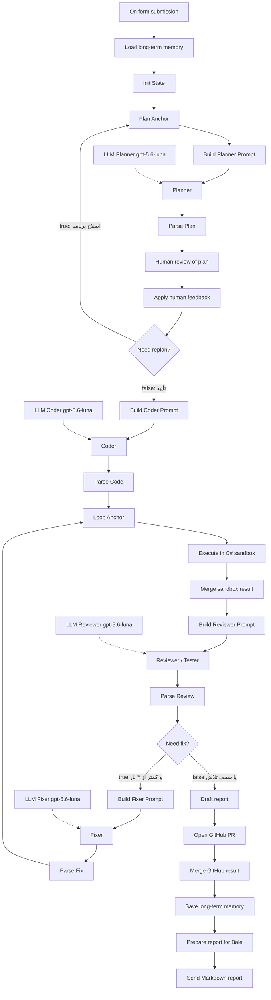

# معماری و نحوهٔ کار ایجنت کدنویس

این سند توضیح می‌دهد نودهای ورک‌فلو n8n چطور به هم وصل می‌شوند، state بین آن‌ها چیست، sandbox چه می‌کند، و پروژه را چطور اجرا کنید.

ورک‌فلو روی `https://n8n.denox.ir/workflow/LkpwmWAnSXuBzQ8q` فعال است. نام ورک‌فلو: **final exam**.

---

## خلاصهٔ پروژه

یک **Coding Agent چند-عاملی** است:

1. کاربر درخواست را در فرم n8n می‌نویسد (C# / .NET 8).
2. **Planner** برنامهٔ JSON می‌سازد.
3. انسان در **بله** برنامه را تأیید می‌کند یا با بازخورد متنی اصلاح می‌خواهد.
4. **Coder** پروژهٔ کامل را تولید می‌کند.
5. **Sandbox Docker** واقعاً `restore / build / run` می‌کند (نه شبیه‌سازی LLM).
6. **Reviewer** روی خروجی واقعی قضاوت می‌کند.
7. اگر شکست خورد، **Fixer** حداکثر ۳ بار کد را اصلاح می‌کند و دوباره اجرا می‌شود.
8. روی GitHub PR ساخته می‌شود و گزارش Markdown به بله می‌رود.

| مورد | مقدار |
| --- | --- |
| مدل همهٔ عامل‌ها | `gpt-5.6-luna` (credential: `OpenAI account Proxy`) |
| زبان خروجی | فقط C# / .NET 8 |
| HITL | نود Telegram + credential `Bale account`، چت `1753826181` |
| Sandbox عمومی | `https://sandbox.denox.ir` → Docker روی پورت `8099` |
| ریپوی PR | [ashkandehnavi/n8n-code](https://github.com/ashkandehnavi/n8n-code) |
| حافظهٔ بلندمدت | Data Table `coding_agent_memory` |
| Timeout کل ورک‌فلو | ۱۵ دقیقه (`executionTimeout: 900`) |
| Timeout هر اجرا در sandbox | حداکثر ۶۰ ثانیه (در درخواست n8n) |
| محدودیت کانتینر | ۱GB RAM، ۱ CPU |

فرم شروع: `https://n8n.denox.ir/form/coding-agent`

---

## جریان نودها (نمای کلی)

در n8n نود IF خروجی اول = **true** و خروجی دوم = **false** است.



خط‌چین‌ها اتصال **Language Model** هستند، نه مسیر دادهٔ اصلی.

---

## State مشترک

بعد از `Init State` تقریباً همهٔ نودهای Code روی یک شیء JSON کار می‌کنند و آن را جلو می‌برند. فیلدهای مهم:

| فیلد | نقش |
| --- | --- |
| `run_id` | شناسهٔ این اجرا؛ برنچ GitHub هم از روی آن ساخته می‌شود |
| `user_request` / `project_name` | ورودی فرم |
| `memory` | درس‌های قبلی از Data Table |
| `plan` / `plan_telegram` | خروجی Planner |
| `plan_round` / `max_plan_rounds` | حلقهٔ بازتخطیط؛ سقف ۳ |
| `human_feedback` / `decision` | پاسخ انسان در بله |
| `files` | دیکشنری مسیر → محتوای فایل |
| `kind` | `console` یا `web` |
| `execution` | نتیجهٔ واقعی sandbox |
| `attempts` | تاریخچهٔ اجراها برای Fixer |
| `review` | حکم Reviewer (`passed`, `issues`, …) |
| `fix_attempt` / `max_fix` | حلقهٔ اصلاح؛ سقف ۳ |
| `sandbox_url` | ثابت: `https://sandbox.denox.ir` |
| `github` | نتیجهٔ PR |
| `report_md` | گزارش نهایی |

این همان **حافظهٔ کوتاه‌مدت درون اجرا** است. بین اجراها، Data Table درس می‌ماند.

---

## مرحله به مرحله

### ۱. شروع: فرم

**On form submission** (`formTrigger`)

- فیلدها: درخواست (اجباری)، نام پروژه (اختیاری).
- `responseMode: onReceived`: مرورگر بلافاصله پیام ثبت را می‌بیند و منتظر ۱۵ دقیقه نمی‌ماند.
- ادامه در بله و اجرای پس‌زمینه است.

### ۲. حافظه و Init

**Load long-term memory** → چند ردیف اخیر `coding_agent_memory`.

**Init State** → `run_id`، سقف حلقه‌ها، `sandbox_url`، کپی درخواست فرم.

**Plan Anchor** → نقطهٔ برگشت حلقهٔ Planner (نود Code که state را عبور می‌دهد).

### ۳. Planner

**Build Planner Prompt** متن را از درخواست + حافظه + بازخورد انسان می‌سازد.

**Planner** (Agent) + **LLM Planner gpt-5.6-luna** فقط JSON برنامه می‌دهد: عنوان، خلاصه، فرض‌ها، گام‌ها، فایل‌ها، `kind`, انتظار اجرا. کد نمی‌نویسد.

**Parse Plan** JSON را استخراج می‌کند و `plan_telegram` (متن کوتاه برای بله، حداکثر حدود ۳۵۰۰ کاراکتر) می‌سازد.

### ۴. انسان در حلقه (بله)

**Human review of plan**: Telegram `sendAndWait`، credential `Bale account`.

- پیام برنامه به چت `1753826181`.
- دکمهٔ «بازخورد بده» فرم سفارشی باز می‌کند:
  - تصمیم: تأیید و ادامه / اصلاح برنامه
  - بازخورد متنی: اجباری

اجرا اینجا **متوقف** می‌ماند تا انسان جواب بدهد. این زمان داخل timeout ۱۵ دقیقه‌ای ورک‌فلو حساب می‌شود؛ پاسخ را زود بدهید.

**Apply human feedback** تصمیم و متن را به state می‌چسباند. اگر تصمیم شامل «اصلاح» باشد و `plan_round < max_plan_rounds`، `needs_replan = true`.

**Need replan?**

- true → برمی‌گردد به **Plan Anchor** (Planner دوباره، با بازخورد).
- false → **Build Coder Prompt**.

### ۵. Coder

**Coder** + **LLM Coder** پروژهٔ کامل `.cs` + `.csproj` را به‌صورت JSON می‌دهد.

**Parse Code** فایل‌ها را در `files` می‌گذارد. اگر JSON خراب باشد، یک کنسول حداقلی جایگزین می‌شود تا حلقهٔ اجرا نشکند.

**Loop Anchor** نقطهٔ برگشت Fixer است.

### ۶. اجرای واقعی

**Execute in C# sandbox** → `POST https://sandbox.denox.ir/execute`

بدنه تقریباً:

```json
{ "run_id": "...", "kind": "console|web", "timeout_seconds": 60, "files": { "...": "..." } }
```

Sandbox داخل کانتینر:

1. فایل‌ها را در پوشهٔ کار می‌نویسد.
2. اگر csproj نبود، برای `web` پروژهٔ Web SDK و برای کنسول `OutputType=Exe` می‌سازد.
3. `dotnet restore` → `dotnet build`.
4. کنسول: `dotnet run`. وب: روی پورت داخلی گوش می‌دهد و `GET /` را probe می‌کند.
5. stdout / stderr / exit code / timeout / بدنهٔ HTTP را برمی‌گرداند.
6. پوشهٔ کار پاک می‌شود.

**Merge sandbox result** این JSON را در `execution` می‌گذارد و به `attempts` اضافه می‌کند.

UI همین API را در `http://127.0.0.1:8099` هم دارد (بدون توکن).

### ۷. Reviewer و Fixer

**Reviewer / Tester** فقط با خروجی واقعی تصمیم می‌گیرد `passed`.

**Parse Review** اگر `passed !== true` و `fix_attempt < max_fix` آنگاه `needs_fix = true`.

**Need fix?**

- true → **Fixer** فایل‌ها را کامل بازنویسی می‌کند (نه patch)، بعد **Parse Fix** → دوباره **Loop Anchor** → sandbox.
- false → گزارش و GitHub؛ حتی اگر هنوز شکست خورده باشد (سقف تلاش تمام شده).

### ۸. گزارش، GitHub، بله

**Draft report** Markdown شامل درخواست، بازخورد، plan، لیست فایل، JSON اجرای واقعی.

**Open GitHub PR** → `POST …/github/publish`  
برنچ `agent/{run_id}`، فایل‌ها زیر `generated/{run_id}/`، PR به `main` روی `ashkandehnavi/n8n-code`. به `GH_TOKEN` روی کانتینر نیاز دارد.

**Save long-term memory** یک ردیف با درخواست و lesson (موفق/ناموفق + نکات).

**Send Markdown report** همان گزارش را به همان چت بله می‌فرستد (ارسال معمولی، نه wait). اگر طولانی باشد کوتاه می‌شود (حدود ۴۰۰۰ کاراکتر).

---

## نقش هر نوع نود

| نوع n8n | نودها | کار |
| --- | --- | --- |
| Form Trigger | On form submission | شروع اجرا |
| Data Table | Load / Save long-term memory | حافظه بین اجراها |
| Code | Init، Parse، Merge، Promptها، گزارش | کنترل state |
| Agent + OpenAI Chat | Planner, Coder, Reviewer, Fixer | نقش‌های LLM |
| Telegram | Human review، Send report | HITL و اطلاع‌رسانی |
| IF | Need replan? ، Need fix? | دو حلقه |
| HTTP Request | Execute sandbox، Open GitHub PR | دنیای واقعی |
| Sticky Note | سه یادداشت روی کانواس | مستند داخل ادیتور |

چهار LLM جدا هستند تا نقش‌ها قاطی نشوند؛ همه‌شان یک مدل و یک credential دارند.

---

## ساختار ریپو

```
sandbox/                 وب‌اپ ASP.NET + Docker اجرای C# و publish گیت‌هاب
  Program.cs             /health /execute /github/publish + UI در wwwroot
  docker-compose.yml     پورت میزبان 8099 → 8080 داخل کانتینر
n8n/coding-agent.workflow.json
scripts/build_workflow.py
scripts/upload_to_n8n.py
scripts/start-sandbox.ps1
ARCHITECTURE.md          همین سند
README.md
```

---

## نحوهٔ اجرا

### پیش‌نیاز

- Docker Desktop برای کانتینر sandbox (اگر روی همین ماشین اجرا می‌کنید).
- روی سرور denox، `https://sandbox.denox.ir` باید به همان کانتینر روی `8099` برسد.
- در `.env` سندباکس: `GH_TOKEN` و در صورت نیاز `GITHUB_REPO` (برای PR). توکن sandbox وجود ندارد.
- n8n از قبل با credentialهای OpenAI Proxy و Bale account و Data Table ست شده.

### ۱) روشن کردن sandbox

```powershell
.\scripts\start-sandbox.ps1
```

چک سلامت:

- محلی: `http://127.0.0.1:8099/health`
- عمومی: `https://sandbox.denox.ir/health`

پاسخ باید شبیه `{ "ok": true, ... }` باشد.

از UI محلی می‌توانید کد را دستی هم اجرا کنید: `http://127.0.0.1:8099`

### ۲) یک درخواست واقعی

1. فرم: `https://n8n.denox.ir/form/coding-agent`
2. درخواست C# کوتاه و قابل‌تست بنویسید (مثلاً کنسول که جمع دو عدد را چاپ کند).
3. در بله، دکمه را بزنید، تصمیم + بازخورد متنی بدهید.
4. صبر کنید تا اجرا، اصلاح احتمالی، PR و گزارش در بله برسد.

در ادیتور n8n، تب Executions مسیر نودها و خطا را نشان می‌دهد.

### ۳) بازتولید JSON ورک‌فلو (اختیاری)

اگر نودها را در پایتون عوض کردید:

```powershell
python .\scripts\build_workflow.py
python .\scripts\upload_to_n8n.py
```

`SANDBOX_URL` پیش‌فرض `https://sandbox.denox.ir` است. آپلود به کوکی لاگین n8n نیاز دارد.

---

## محدودیت‌ها و نقاط گیر

- اگر انسان در بله دیر جواب بدهد، ورک‌فلو ممکن است روی ۱۵ دقیقه timeout بخورد.
- اگر sandbox پایین باشد، نود Execute خطا می‌دهد؛ Reviewer/Fixer با همان خطا جلو می‌روند تا سقف ۳.
- اگر `GH_TOKEN` نباشد، اجرا و گزارش انجام می‌شود ولی PR ساخته نمی‌شود.
- فقط C#؛ پکیج NuGet اضافه ممنوع است.
- ویدئوی ۱۵ دقیقه‌ای در این تحویل نیست.

اگر اجرا گیر کرد، گزارش Markdown معمولاً آخرین `execution` و مرحله (`restore` / `build` / `run` / `run-web`) را دارد.
